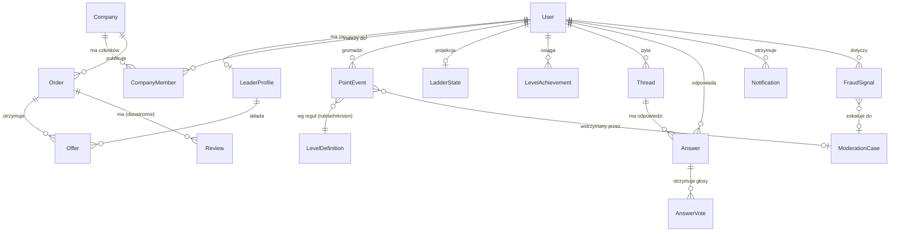

# Model danych — poziom koncepcyjny

Model wysokiego poziomu pod schemat Prisma (MySQL 8). Nazwy i pola to kontrakt kierunkowy — szczegóły (typy kolumn, wszystkie pola pomocnicze) doprecyzuje schemat w fazie 0/1.

## ERD

## Encje

### Tożsamość (moduł `identity`)

- **User** — jedno konto na osobę; e-mail + hasło (argon2id), role (`USER`, `MODERATOR`, `ADMIN`). Rejestracja otwarta, bez bramki (brief 3.1). Uwaga: *zarejestrowany ≠ Lider* — tytuł Lidera wynika ze stanu Drabinki, nie z rejestracji.
- **LeaderProfile** — profil publiczny użytkownika działającego jako Lider: branża/kompetencja (słownik `Industry`), bio, portfolio (pozycje z linkami/plikami), widoczność w wyszukiwarce. Tworzony przez użytkownika, gdy chce działać po stronie podażowej.
- **Company** — profil firmowy (nazwa, NIP *opcjonalny na starcie* — brak weryfikacji zgodnie z briefem 3.4, ale pole gotowe pod przyszłą weryfikację), branża, opis. **CompanyMember** wiąże userów z firmą (rola `OWNER`/`MEMBER`) — jedna osoba może działać i jako Lider, i w imieniu Firmy, ale guardraile ADR-004 widzą to powiązanie.
- **OidcClient / OidcGrant / OidcKey** (faza 2) — storage dla `oidc-provider`: zarejestrowani klienci (app.leadersofteams.com), granty/sesje/kody, klucze JWKS z rotacją.

### Marketplace (moduł `marketplace`)

- **Order** — zlecenie: tytuł, opis, kategoria/branża, `declaredBudget` (widełki), **`minLevel`** (minimalny poziom Lidera, który widzi/może ofertować — mechanizm „małe zlecenia na start", brief 3.2; dla dużych budżetów `minLevel` wymuszany polityką, nie tylko wyborem Firmy), status: `DRAFT → PUBLISHED → AWARDED → IN_PROGRESS → DELIVERED → CONFIRMED → RATED` + `CANCELLED`/`DISPUTED`, `settlementStatus` (pole przyszłościowe pod płatności, ADR-006).
- **Offer** — oferta Lidera do zlecenia: treść, proponowane widełki/termin, status (`SUBMITTED/WITHDRAWN/ACCEPTED/REJECTED`). Unikat (`orderId`,`leaderProfileId`).
- **Review** — dwustronna ocena po `CONFIRMED`: Firma→Lider (źródło punktów) i Lider→Firma (reputacja Firmy — istotna wobec braku weryfikacji na starcie). Ocena 1–5 + wymiary + komentarz; publikacja symultaniczna (obie na raz albo po upływie okna), żeby uniknąć ocen odwetowych.

### Społeczność (moduł `community`)

- **Thread** — wątek Q&A/mentoringowy: tytuł, treść, kategoria/branża, status (`OPEN/ANSWERED/CLOSED`), autor.
- **Answer** — odpowiedź: treść, `isAccepted` (jedna zaakceptowana per wątek; akceptuje autor pytania → zdarzenie punktowe).
- **AnswerVote** — głos (`UP`, unikat per user+answer); do punktów kwalifikują się tylko głosy od kont spełniających próg wiarygodności (ADR-004) — kwalifikację ocenia moduł `ladder` w momencie naliczania, głos zapisywany zawsze.

### Drabinka (moduł `ladder`) — serce systemu

- **PointEvent** *(append-only)* — `userId`, `type` (zamknięty enum, ADR-004), `points` (wartość po wagach; może być ujemna dla korekt), `weightApplied`, `sourceType`+`sourceId` (polimorficzne wskazanie: Review/Answer/AnswerVote/ModerationCase), `grantedByUserId` (człowiek-poręczyciel), `counterpartyId` (druga strona — pod malejące zwroty), `status` (`PENDING/CONFIRMED/HOLD/REVERSED`), `reversalOfId`, `rulesetVersion`, `createdAt`. **Bez `updatedAt`** poza zmianą `status` — treść wpisu niemutowalna.
- **LevelDefinition** — 7 poziomów: próg punktów łącznych, wymóg minimalnego udziału obu ścieżek (od poziomu 4), odblokowania (`maxOrderBudget` widoczny na portalu; `unlocksAppAccess`, `unlocksTeamCreation` dla najwyższych), `rulesetVersion`.
- **LadderState** *(projekcja, odtwarzalna z ledgera)* — `userId`, punkty `CONFIRMED` (łącznie + rozbicie na ścieżki marketplace/community), bieżący poziom, `isLeader` (tytuł od poziomu 1), przeliczana wyłącznie przez worker `ladder`.
- **LevelAchievement** — fakt awansu: user, poziom, data, id-idempotencji dla webhooka (ADR-003). Poziom nie wygasa (brief: brak mechanik utraty statusu).

### Antyfraud i moderacja (moduł `antifraud`)

- **FraudSignal** — sygnał z detektorów: typ (`RECIPROCITY`, `VELOCITY`, `NEW_ACCOUNT_PATTERN`, `SHARED_FINGERPRINT`…), dotknięci userzy/firmy, payload dowodowy, poziom pewności.
- **ModerationCase** — sprawa dla moderatora: źródło (sygnał/zgłoszenie użytkownika/spór zlecenia), status, decyzja, skutek (np. `PointEvent` typu `ADJUSTMENT_MODERATION`, zdjęcie `HOLD`).

### Infrastruktura domenowa

- **OutboxEvent** — wzorzec outbox (ADR-007): typ zdarzenia, payload JSON, status publikacji; zapis w tej samej transakcji co zmiana stanu.
- **Notification** — powiadomienia in-app: typ, payload, `readAt`; preferencje kanałów per user (digest e-mail zamiast spamu).
- **WebhookDelivery** (moduł `integration`) — log dostaw do app.leadersofteams.com: payload, podpis, próby, status — audyt i DLQ.

## Indeksy i wydajność (kluczowe decyzje)

- **Wzorce dostępu → indeksy złożone:** `Order(status, industryId, minLevel, publishedAt)` dla listingu; `Offer(orderId, status)`; `PointEvent(userId, status, createdAt)` dla ekranu „Moje punkty" i projekcji; `PointEvent(counterpartyId, userId, createdAt)` dla malejących zwrotów; `Thread(industryId, status, lastActivityAt)`; `Notification(userId, readAt, createdAt)`.
- **FULLTEXT (parser ngram)** na `Order(title, description)` i `Thread(title, body)` — wyszukiwarka MVP; Meilisearch jako opcjonalny upgrade w fazie 3 bez zmiany schematu.
- **Duże tabele:** `PointEvent`, `Notification`, `OutboxEvent`, `WebhookDelivery` rosną liniowo. Przy 10k userów to rzędu pojedynczych milionów wierszy rocznie — MySQL z poprawnymi indeksami obsługuje to bez partycjonowania. Strategia: **archiwizacja zamiast partycji** (miesięczny job przenosi `Notification` > 6 mies. i opublikowane `OutboxEvent` > 3 mies. do tabel archiwalnych; `PointEvent` **nigdy nie jest archiwizowany ani usuwany** — to księga główna). Partycjonowanie po `createdAt` pozostaje udokumentowaną opcją, jeśli tabele przekroczą ~50 mln wierszy.
- **Blokady:** projekcja `LadderState` przeliczana sekwencyjnie per user (lock w BullMQ) — brak wyścigów bez blokad pesymistycznych w MySQL.

## Zasady RODO (minimum projektowe)

Dane osobowe tylko w `User`/`LeaderProfile`/`Company`; usunięcie konta = anonimizacja (pseudonimizacja `User`, ledger punktowy zostaje jako zapis księgowy bez danych osobowych); eksport danych na żądanie (job w kolejce `maintenance`).
