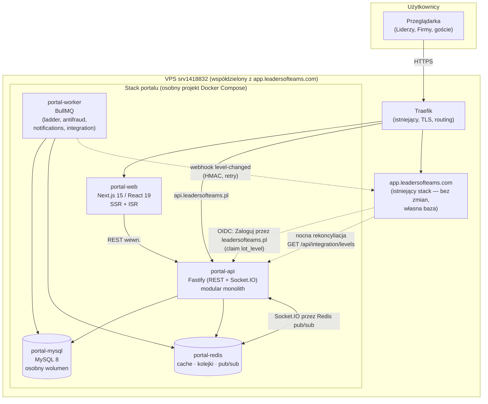
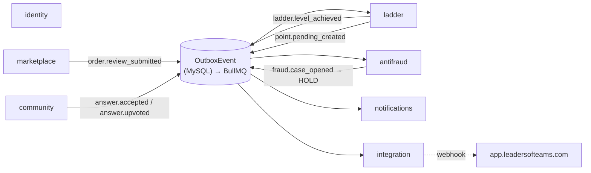

# Architektura Portalu Leaders of Teams — przegląd

**Dokument nadrzędny.** Szczegółowe decyzje z uzasadnieniami: [`adr/`](adr/). Model danych: [DATA-MODEL.md](DATA-MODEL.md). Ryzyka: [../RISKS.md](../RISKS.md). Plan: [../ROADMAP.md](../ROADMAP.md).

## Czym jest system

Platforma leadersofteams.pl łączy trzy mechaniki w jednym produkcie:

1. **Marketplace B2B** (wzorzec Oferteo/Fiverr): Firmy publikują zlecenia → Liderzy składają oferty → realizacja → obustronne potwierdzenie → ocena.
2. **Społeczność** (Q&A/mentoring): wątki pytań, odpowiedzi, akceptacje i głosy — mentoring jako najcenniejsza aktywność społecznościowa.
3. **Drabinka Lidera** (7 poziomów): punkty wyłącznie z dwóch równoważnych, uznaniowych źródeł (ocenione zlecenia + doceniony mentoring); wyższe poziomy odblokowują większe zlecenia na portalu oraz — poziomy najwyższe — darmowy dostęp i własny zespół w app.leadersofteams.com. Twardy wymóg anty-MLM egzekwowany architektonicznie ([ADR-004](adr/ADR-004-ledger-punktowy-i-antyfraud.md)).

## Diagram komponentów

## Moduły backendu (granice z [ADR-002](adr/ADR-002-modular-monolith.md))

Moduły komunikują się **wyłącznie** przez publiczne API modułu (odczyty synchroniczne) i zdarzenia domenowe przez outbox (wszystkie skutki uboczne). Logika punktowa istnieje tylko w `ladder` — jeden punkt audytu dla wymogu anty-MLM.

## Kluczowe przepływy

**Punkty za zlecenie:** Firma ocenia zakończone zlecenie → `marketplace` zapisuje `Review` + `OutboxEvent` (jedna transakcja) → worker `ladder` nalicza `PointEvent(PENDING)` z wagą (malejące zwroty od tego samego kontrahenta) → `antifraud` analizuje (może dać `HOLD`) → po 7 dniach karencji job potwierdza (`CONFIRMED`) → przeliczenie projekcji `LadderState` → ewentualny awans emituje `ladder.level_achieved` → powiadomienie + webhook do app.

**Logowanie do app przez portal:** app przekierowuje na `https://leadersofteams.pl/oauth/authorize` (Authorization Code + PKCE) → użytkownik loguje się na portalu → app wymienia kod na tokeny → ID token zawiera `lot_level` → app aktualizuje lokalną kopię poziomu i odblokowuje nagrody ([ADR-003](adr/ADR-003-integracja-oidc-level-sync.md)).

**Realtime:** mutacja → zdarzenie outbox → worker publikuje sygnał na Redis pub/sub → Socket.IO wypycha do pokoju (`user:{id}` / `thread:{id}`) → klient dociąga dane przez REST. Socket niesie tylko sygnał, nigdy stan.

## Odpowiedzi na otwarte pytania briefu (sekcja 7)

| # | Pytanie | Odpowiedź | Gdzie |
|---|---|---|---|
| 1 | Wzorzec synchronizacji poziomów | 3 warstwy: claim OIDC przy logowaniu + webhook HMAC z retry + nocna rekoncyliacja; portal jedynym źródłem prawdy | [ADR-003](adr/ADR-003-integracja-oidc-level-sync.md) |
| 2 | Protokół logowania | pełny OAuth 2.0/OIDC (`oidc-provider`), nie własny — standard jest tańszy i skaluje się na kolejne brandy | [ADR-003](adr/ADR-003-integracja-oidc-level-sync.md) |
| 3 | Wspólny czy osobny VPS | wspólny na start (decyzja właściciela), osobny stack compose + własny MySQL + limity zasobów; migracja przy mierzalnych progach | [ADR-005](adr/ADR-005-infrastruktura-vps.md) |
| 4 | Kolejność MVP | marketplace + Q&A + pełna Drabinka od dnia 1 (obie ścieżki punktowania — wymóg równowagi); integracja z app jako faza 2 (naturalny runway: nikt nie osiągnie progu unlock w pierwszych tygodniach) | [ROADMAP](../ROADMAP.md) |
| 5 | Płatności w MVP | nie — lead-gen z formalnym cyklem życia zlecenia; model danych gotowy na prowizję/escrow później | [ADR-006](adr/ADR-006-platnosci-w-mvp.md) |
| 6 | Architektura pod 10k na VPS | modular monolith, role api/worker, Redis (cache+BullMQ+pub/sub), Socket.IO, indeksy + strategia dużych tabel, CI/CD GitHub Actions → GHCR → SSH | [ADR-002](adr/ADR-002-modular-monolith.md), [ADR-005](adr/ADR-005-infrastruktura-vps.md), [ADR-007](adr/ADR-007-cache-kolejki-realtime.md), [ADR-008](adr/ADR-008-ci-cd.md) |
| 7 | Guardraile antyfraudowe | append-only ledger, zamknięty enum źródeł punktów (zero za rekrutację — w schemacie), okno karencji, malejące zwroty, detekcja wzajemności, progi wiarygodności, moderacja | [ADR-004](adr/ADR-004-ledger-punktowy-i-antyfraud.md) |
